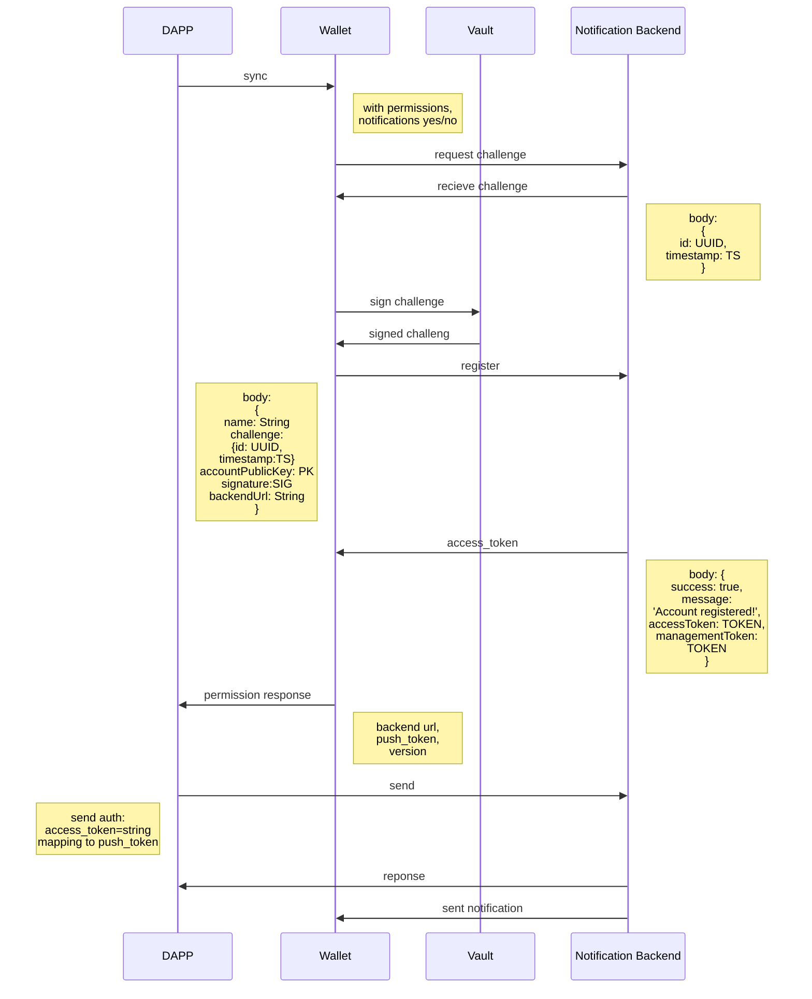

```mermaid
sequenceDiagram
participant DAPP
participant Wallet
participant Vault
participant Notification Backend

DAPP->>Wallet: sync
#Note right of Wallet: permissions asked #-> response contains all info)
#Note right of Wallet: notifications yes/no

Note right of Wallet: with permissions,<br/> notifications yes/no #<br/>-> response contains <br/>all info
Wallet->>Notification Backend: request challenge
Notification Backend->>Wallet: recieve challenge

Note right of Notification Backend: body: <br> { <br> id: UUID, <br> timestamp: TS <br>}

Wallet ->> Vault: sign challenge
Vault ->> Wallet: signed challeng
Wallet->>Notification Backend: register
Note left of Wallet: body: <br> { <br> name: String <br> challenge:<br>{id: UUID, <br> timestamp:TS} <br> accountPublicKey: PK <br> signature:SIG <br> backendUrl: String<br> }

# Note right of Notification Backend: body: { }
Notification Backend ->> Wallet: access_token
Note right of Notification Backend: body: { <br> success: true, <br> message: <br>'Account registered!', <br> accessToken: TOKEN, <br> managementToken: <br> TOKEN <br>}

Wallet ->> DAPP: permission response #(incl. notification backend url, push_token, version of backend)
Note right of Wallet: backend url, <br/>push_token,<br/> version

DAPP ->> Notification Backend: send #auth: access_token = random ID -> mapping to push_token (existing)
# Note left of DAPP: body: { }
Note left of DAPP: send auth: <br>access_token=string<br> mapping to push_token
Notification Backend ->> DAPP: reponse
# Note right of Notification Backend: body: { }

Notification Backend ->> Wallet: sent notification 
# Note right of Notification Backend: body: { }


```
